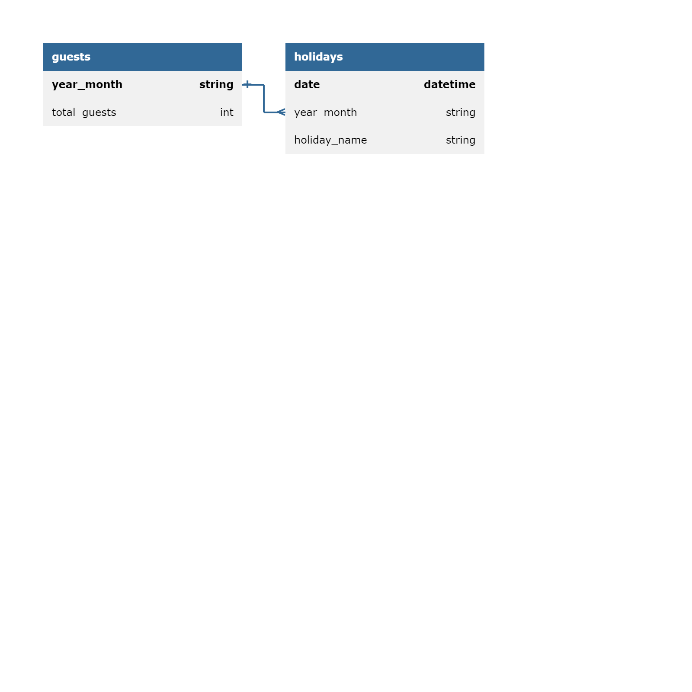
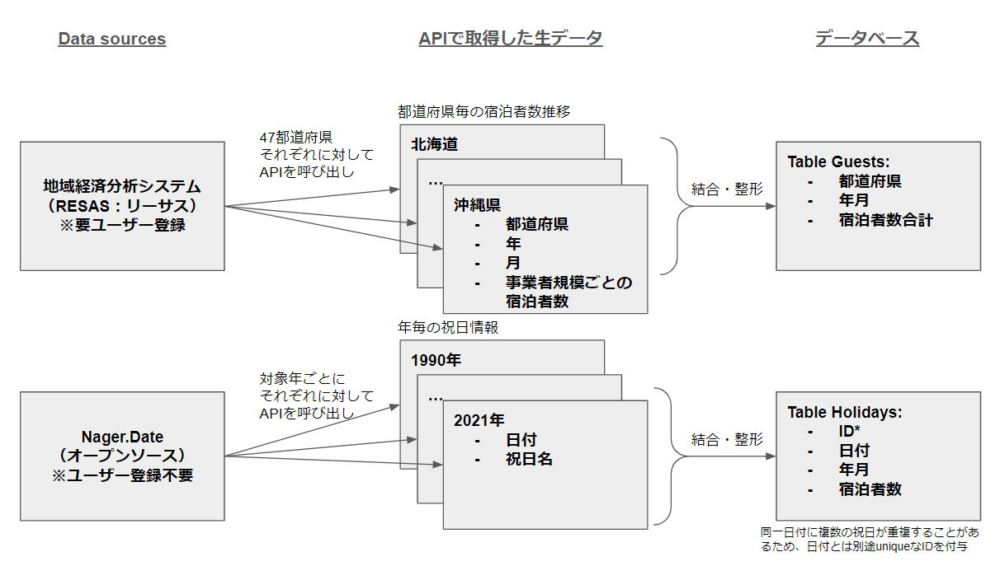

# セットアップと実行の手順
## Pythonのセットアップ
- [Python公式サイト](https://www.python.org/downloads/)からインストールしてください。
## プロジェクトのクローンまたはダウンロード:
- リポジトリをクローンまたはダウンロードしてください。
```
https://github.com/sadanobu-mizusako/python-03-project-ja
```

## API認証情報の取得
- RESASのAPIには認証キーが必要となります。
- チームメンバー、講師の先生方は[こちら](https://drive.google.com/file/d/1yqpJDss3BeNUIjrkk1Zarp3bBXy2Sq1l/view?usp=drive_link)からconfig.iniをコピーしてお使いください。
- 一般利用者はご自身でRESASの[Webサイト](https://opendata.resas-portal.go.jp/form.html)から申請を行い認証キーを取得してください。

## config.iniの設定
本プログラムを実行する前に、認証情報を記述したconfig.iniファイルを用意する必要があります。config.iniは、以下のような構成としてください。
```
[RESAS]
API_KEY = YOUR_API_KEY
```
YOUR_API_KEYには、ご自身で取得された認証キーを記載ください。

また、main.py中の10行名では、
```python
con.read("../../config.ini") # config情報を格納しているpathを指定してください。
```
により、config.iniを読み込んでいますので、必要に応じてパスを変更してください。

## プログラムの実行
- 以下のコマンドでプログラムを実行します。
```bash
python main.py
```

# プロジェクトにおける重要な設計とその設計理由
## 利用用途
- 日本の各月の祝日と宿泊者数の関係を分析するためのデータセットを作成しました。
- 宿泊業者や宿泊業を分析したい人達の以下の問いに答えることを想定しています。
    - その月の祝日の日数によって、宿泊者数がどう変化するのか予測したい
    - 連休の有無、祝日が土日と重なった際、宿泊者数がどう変化するのか予測したい
    - 等
## ER図
上記の利用用途を想定して、以下のRDBを設計・実装しました。


## データフローの概要
ER図に記載されたテーブルはそれぞれ以下のデータフローにより作成されています。

## データソース
guestsとholidaysにはそれぞれ異なるAPIを使用しています。
### guests
地域経済分析システム（RESAS：リーサス）のデータを提供するAPIを使用しています。
- 地域経済分析システム（以下、RESAS）は、地域に関する官民の様々なデータを搭載し、誰もが分かりやすいように「見える化」したシステムです。
- このシステムは、自治体職員の方や、地域の活性化に関心を持つ様々な分野の方によって、効果的な施策の立案・実行・検証のためなどに広く利用されています。

今回利用したのは、延べ宿泊者数の推移を取得するAPIです。詳細は以下のリンクをご覧ください。
- https://opendata.resas-portal.go.jp/docs/api/v1/tourism/hotelAnalysis/groupStack.html

### holidays
Nager.Dateというオープンソースプロジェクトが提供する国ごとの祝日を取得するAPIを利用しました。詳細は以下をリンクをご覧ください。
- https://date.nager.at/Api

# このツールまたはサービスの使い方の説明 (ユーザー向けの説明)
## このツールについて
- これは日本の各月の祝日と宿泊者数の関係を分析するためのツールです。
- 具体的には、以下のことができます。
    - 月ごとの祝日数と宿泊者数のデータ取得
    - 年ごとの祝日数と宿泊者数のデータ取得
    - その他、ご自身で分析したいクエリの実行（データのスキーマは上記のER図をご参照ください）
- 上記以外でご要望のデータ整形がありましたら、プロジェクトメンバーまでお知らせください。対応を検討いたします。

## 利用手順
- プログラム実行後、画面のガイドに従って操作を選択してください。
    - 1: 月ごとの祝日数と宿泊者数のデータ取得し画面に表示します
    - 2: 年ごとの祝日数と宿泊者数のデータ取得し画面に表示します
    - 3: DBのデータをローカル環境に保存します
    - 9: プログラムを終了します。
- 上記以外の入力があった場合、入力をデータベースに対する操作とみなして、クエリを実行します。ただし、delete、updateなど、既存のデータベースに変更を加える操作は禁止いたします。

## Localに保存されるデータの形式
以下の形式で年毎に分割されたデータが保存されます。
- data_holidays
    - 2011
        - data.csv
    - 2012
        - data.csv
    - ...
- data_guests
    - 2011
        - data.csv
    - 2012
        - data.csv
    - ...