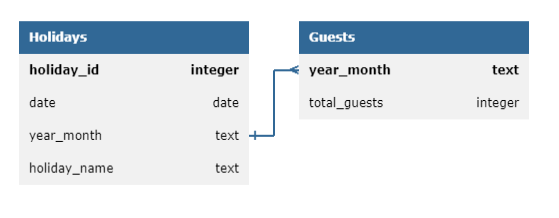

# セットアップと実行の手順
## API認証情報
- RESASのAPIには認証キーが必要となります。
- チームメンバー、講師の先生方は[こちら](https://drive.google.com/file/d/1yqpJDss3BeNUIjrkk1Zarp3bBXy2Sq1l/view?usp=drive_link)からconfig.iniをコピーしてお使いください。
- 一般利用者はご自身でRESASの[Webサイト](https://opendata.resas-portal.go.jp/form.html)から申請を行い認証キーを取得してください。

## config.iniの設定
config.iniは、以下のような構成としてください。
```
[RESAS]
API_KEY = YOUR_API_KEY
```

# プロジェクトにおける重要な設計とその設計理由
## 利用用途
- 日本の各月の祝日と宿泊者数の関係を分析するためのデータセットを作成しました。
- 宿泊業者や宿泊業を分析したい人達の以下の問いに答えることを想定しています。
    - その月の祝日の日数によって、宿泊者数がどう変化するのか予測したい
    - 連休の有無、祝日が土日と重なった際、宿泊者数がどう変化するのか予測したい
    - 等
## ER図
上記の利用用途に即して、以下の構造のRDBを設計しました。


## データソース
guestsとholidaysにはそれぞれ異なるAPIを使用しています。
### guests
地域経済分析システム（RESAS：リーサス）のデータを提供するAPIを使用しています。
- 地域経済分析システム（以下、RESAS）は、地域に関する官民の様々なデータを搭載し、誰もが分かりやすいように「見える化」したシステムです。
- このシステムは、自治体職員の方や、地域の活性化に関心を持つ様々な分野の方によって、効果的な施策の立案・実行・検証のためなどに広く利用されています。

今回利用したのは、延べ宿泊者数の推移を取得するAPIです。詳細は以下のリンクをご覧ください。
- https://opendata.resas-portal.go.jp/docs/api/v1/tourism/hotelAnalysis/groupStack.html

### holidays
Nager.Dateというオープンソースプロジェクトが提供する国ごとの祝日を取得するAPIを利用しました。詳細は以下をリンクをご覧ください。
- https://date.nager.at/Api

# このツールまたはサービスの使い方の説明 (ユーザー向けの説明)
TBU